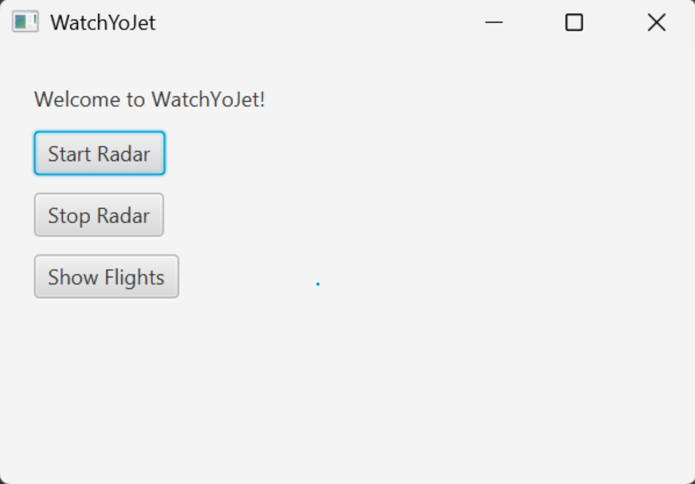
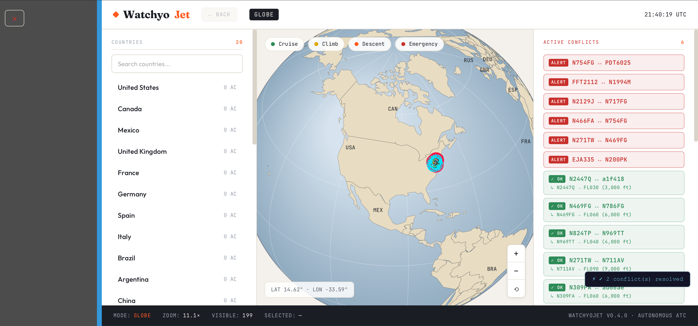

# WatchyoJet — Autonomous ATC Shadow System

**WatchyoJet** is a real-time autonomous Air Traffic Control (ATC) decision system running in **shadow mode** over the Philadelphia TRACON airspace. It pulls live flight data from the [OpenSky Network](https://opensky-network.org), simulates aircraft movement, detects separation conflicts using Closest Point of Approach (CPA) math, and automatically issues altitude, heading, and speed resolutions — with no human input.

> **Shadow mode** means the system makes decisions and logs them, but does not transmit commands to real aircraft.

**How we started** 


**How we finished**


---

## What it does

- Fetches live aircraft positions from the **OpenSky Network API** every 12 seconds (PHL TRACON, ~60 NM radius around Philadelphia International)
- Tracks **80–250 live flights** simultaneously
- Simulates aircraft movement between API refreshes using 2-second cycles
- Detects conflicts using **CPA math** — predicts converging aircraft before they get close
- Classifies conflicts as `CRITICAL`, `HIGH`, or `MEDIUM`
- Resolves conflicts automatically by issuing:
  - Altitude changes (primary)
  - Heading divergence (secondary)
  - Speed reductions (last resort)
- **Escalation logic**: if a conflict persists >2 cycles, forces hard separation (≥1000 ft vertical or >20° heading divergence)
- Displays everything on a **live interactive map** with aircraft markers, conflict highlights, and an ATC event log
- Falls back to a built-in demo scenario if the OpenSky API is unavailable

---

## Requirements

| Tool | Version | Download |
|------|---------|----------|
| Java JDK | **21 or higher** | https://adoptium.net |
| Maven | **3.8 or higher** | https://maven.apache.org/download.cgi |
| Internet connection | Required | Live OpenSky API |

**Verify Java:**
```
java -version
```
Must print `openjdk 21` or higher.

**Verify Maven:**
```
mvn -version
```
Must print `Apache Maven 3.x.x`.

> **macOS shortcut (Homebrew):** `brew install --cask temurin@21` and `brew install maven`

---

## Running the Application

### Step 1 — Get the code

**Clone the repository:**
```bash
git clone https://github.com/cis3296s26/final-project-05-watchyojet.git
cd final-project-05-watchyojet
```

Or download and unzip from the [Releases](https://github.com/cis3296s26/final-project-05-watchyojet/releases) page.

### Step 2 — Run

```bash
mvn javafx:run
```

Maven downloads all dependencies automatically on the first run (~100 MB). The application window opens within 10–15 seconds.

> **Windows:** the command is identical — run it in Command Prompt or PowerShell.

**For Windows Users
1. Downloaded Apache Maven from wesbite
2. Unzip file
3. Create new folder in C: drive named Maven
4. Go to System Properties -> Advanced
5. Bottom right of screen click Environment Variables
6. Under System variables, double-click Path
7. Click new, and copy the path of maven/bin
8. Press ok
9. Open IDE, use "mvn javafx:run" to start the application

---

## What to expect when it starts

Terminal output:
```
Initializing WatchyoJet Autonomous ATC Shadow Mode...
[SYSTEM] Fetching LIVE traffic (PHL Airspace)...
[SYSTEM] Airspace refreshed. Tracking 87 live flights.
```

The GUI window shows:
- **Live map** of PHL airspace with aircraft icon markers
- **Colors:** white = normal, yellow = near conflict, red = active conflict, green = recently resolved
- **Click any aircraft** to see callsign, altitude, speed, and heading
- **Event log panel** on the right with real-time ATC decisions

When a conflict is detected:
```
[CONFLICT DETECTED]
AAL123 ↔ UAL456
→ tCPA: 87 sec
→ dCPA: 0.41 NM
→ Altitude diff: 200 ft
→ Severity: CRITICAL

[RESOLVED] AAL123 → 32000 ft
```

When a conflict persists and escalates:
```
[ESCALATE] 1 conflict pair(s) persisted >2 cycles → hard resolution
[HARD-ALT] AAL123 → 31000 ft (forced vertical)
```

> The app requires an active internet connection. If OpenSky rate-limits (429), the system logs `[FETCHER] API rate limited` and continues on the last known positions until the next fetch succeeds.

---

## Running the tests

```bash
mvn test
```

6 tests across two classes:
- `ConflictDetectorTest` — conflict detection, altitude separation, multi-aircraft scenarios
- `MovementEngineTest` — straight and diagonal flight movement

Expected:
```
Tests run: 6, Failures: 0, Errors: 0, Skipped: 0
BUILD SUCCESS
```

---

## Building from source

```bash
mvn clean package
```

Produces `target/WatchYoJet-1.0-SNAPSHOT-jar-with-dependencies.jar`.

> Due to JavaFX's modular architecture, the fat jar cannot be launched with `java -jar`. Always use `mvn javafx:run`.

---

## Project structure

```
final-project-05-watchyojet/
├── src/
│   ├── main/java/com/watchyojet/
│   │   ├── engine/
│   │   │   ├── ATCEngine.java            ← 2-second control loop + escalation
│   │   │   ├── ConflictDetector.java     ← CPA-based conflict prediction
│   │   │   ├── ResolutionEngine.java     ← Alt/heading/speed resolution search
│   │   │   └── TrajectoryPredictor.java  ← Position extrapolation
│   │   ├── manager/
│   │   │   ├── AircraftManager.java      ← Thread-safe aircraft registry
│   │   │   └── OpenSkyFetcher.java       ← Live OpenSky API ingestion
│   │   ├── model/
│   │   │   ├── Aircraft.java
│   │   │   ├── AircraftType.java
│   │   │   ├── Conflict.java
│   │   │   └── Resolution.java
│   │   ├── simulation/
│   │   │   ├── MovementEngine.java       ← Dead-reckoning position updates
│   │   │   └── DemoScenario.java         ← Offline fallback scenario
│   │   ├── WYJApp.java                   ← JavaFX entry point
│   │   └── WYJAppController.java         ← UI controller / JS bridge
│   ├── main/resources/                   ← FXML, CSS, map HTML
│   └── test/java/com/watchyojet/
│       ├── engine/ConflictDetectorTest.java
│       └── simulation/MovementEngineTest.java
├── Documentation/
│   ├── WATCHYOJET_DOCS.md                ← Full system documentation
│   ├── uml.html                          ← UML class and sequence diagrams
│   └── presentation.html                 ← Final presentation slides
├── pom.xml
└── README.md
```

---

## Architecture

```
OpenSky Network API
        │
        ▼  every 12 seconds
  OpenSkyFetcher
        │
        ▼
  AircraftManager ── preserves ATC-issued altitudes across refreshes
        │
        ▼  every 2 seconds
    ATCEngine
    ├── MovementEngine       → dead-reckoning lat/lon update
    ├── ConflictDetector     → CPA math, severity classification
    ├── ResolutionEngine     → altitude / heading / speed search
    │   └── escalation       → hard separation after >2 cycles
    └── WYJAppController     → JavaFX UI bridge (Platform.runLater)
                                      │
                                      ▼
                              WebView (Leaflet.js map)
                              + ATC event log panel
```

---

## Tech stack

| Layer | Technology |
|-------|------------|
| Language | Java 21 |
| UI | JavaFX 21 |
| Map | Leaflet.js (embedded in WebView) |
| HTTP | `java.net.http.HttpClient` (built-in) |
| JSON | Jackson `ObjectMapper` |
| Build | Maven 3.8+ |
| Live data | OpenSky Network REST API |
| Frontend | HTML / CSS / JavaScript (no framework) |

---

## Links

- **Repository:** https://github.com/cis3296s26/final-project-05-watchyojet
- **Project board:** https://github.com/orgs/cis3296s26/projects/43/views/1
- **Releases:** https://github.com/cis3296s26/final-project-05-watchyojet/releases

---

## Course

CIS 3296 — Software Design, Spring 2026 | Temple University
